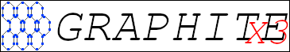

## What is Graphite?
Graphite is a graphics api made for the purpose of simplifying graphics.py module.

## Getting Started
Firstly, you need to go to [the graphite github page](https://github.com/BLINMATIC/graphite) and download version 2.0 from the releases on the right.  
After you navigated to version 2.0, click on `graphite_1_1.zip`.  
When downloaded extract the zip file to a new folder in your project called `graphite_1_1`.  

To import simply type `from graphite_1_1 import graphite`.

## Screen Object
The most important part of a graphite gui is the screen object. You cannot create a gui without a window.  
To create a window:  
`<name> = graphite.Screen(width, height, title)`  
Note that if these values are not provided, then it will use the default values of:  
`width=640, height=480, title="Graphite Window"`

### On The Mainloop
The screen needs to be updated on the mainloop.  
To do this add:  
`<name>.update()`  
tTo the end of your loop.

### Filling The Screen
Your screen will automatically get filled with the default Tkinter background. However if you dont want to use it, just simply add:  
`<name>.fill(red, green, blue)`  
Each color variable goes from 0 to 255 and gets mixed to create every single color.  
Note: put this before the update and any other objects

## Clocks And Timings
if you want your ui to be stable across all computers, then you need to limit the framerate of the display. To do this simply put:  
`<clock_name> = graphite.Time.Clock()`  
And add:  
`<clock_name>.tick(fps)`  
To the start of the mainloop.

Or if you are lazy, then simply add:  
`graphite.Time.sleep(miliseconds)`  
to the start of your mainloop instead.

## Drawing Objects
### Rectangle
To draw a rectangle to the screen, simply add:  
`graphite.Draw.rectangle(x, y, width, height, red, green, blue, screen)`  
After the screen filling operation.

### Line
Drawing a line is very similar, simply add:  
`graphite.Draw.line(x, y, dest_x, dest_y, red, green, blue, screen)`  
After the screen filling operation.

### Images
It may come as a suprise but drawing an image is also really simple and can be done in a single line.  
Just simply type:  
`graphite.Draw.image(x, y, image, screen)`
After the screen filling operation.

### Ellipsis
Since ellipsises and circles are the same thing they are under single function.  
Just simply type:  
`graphite.Draw.ellipsis(x, y, width, height, image, red, green, blue, screen)`
After the screen filling operation.

## Keys
To get if a key is being pressed or not, add:  
```
if graphite.Input.key(keyname):
    code
else:
    code
```

